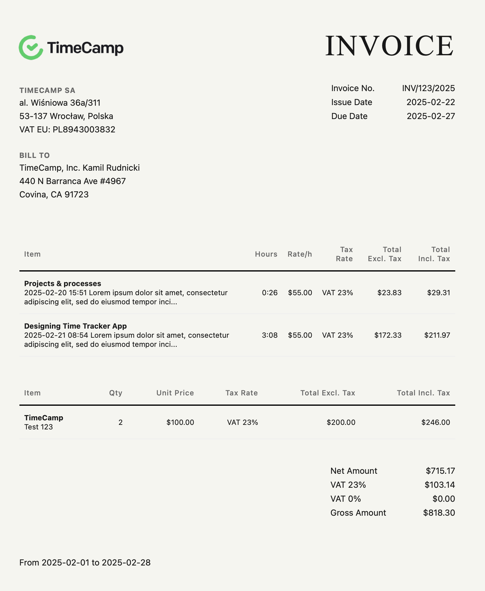

# Twig Invoice Template

A professional invoice templates system built using Twig templating engine for TimeCamp.

## Description

{width=400px}

This project provides a flexible and customizable invoice template system using Twig, allowing you to generate professional-looking invoices with ease.

- Customizable invoice templates
- Dynamic data binding
- Professional formatting
- Easy to modify and extend
- Support for multiple currencies
- PDF generation capability

## Requirements

- PHP 7.4 or higher and composer
- Twig templating engine
- Composer for dependency management

## Installation & usage

```bash
composer install
php -S localhost:8000
```

## Support

Contributions are welcome! Please feel free to submit a Pull Request.

For support, please open an issue in the GitHub repository.
